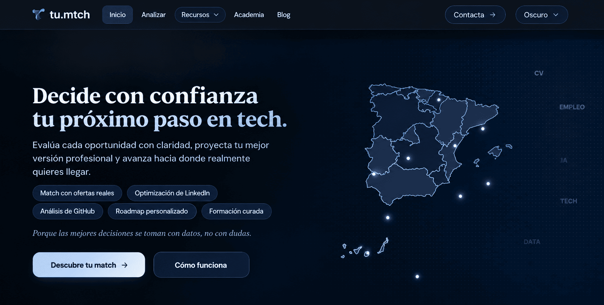
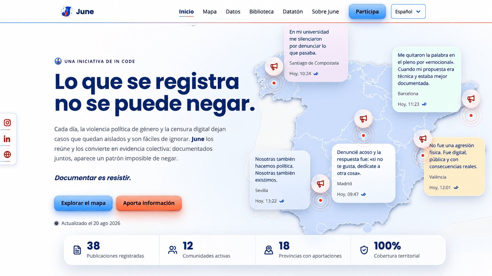
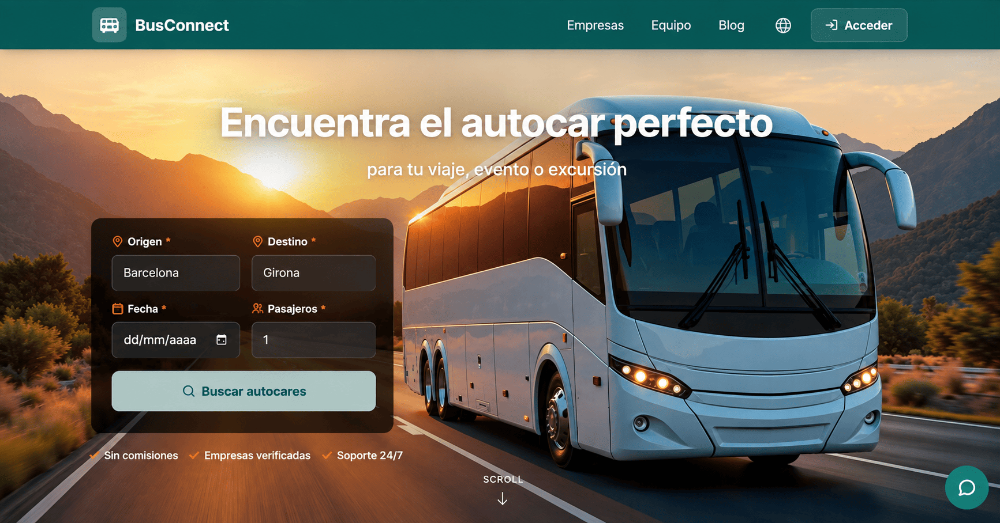
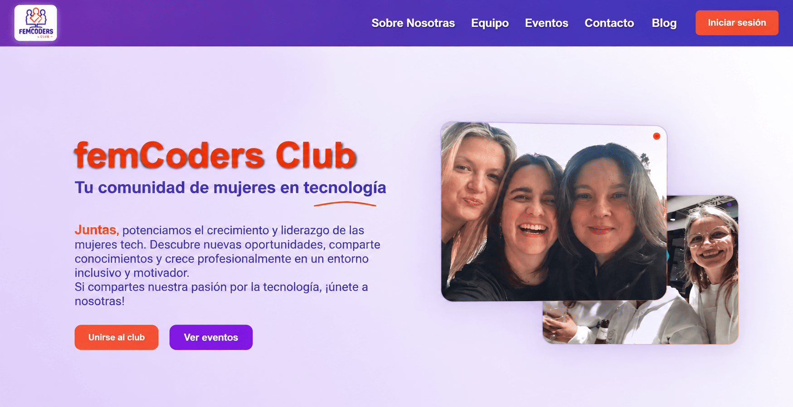

## Hola, soy Irina

Soy Irina, ingeniera de software freelance en Barcelona. Transformo ideas en productos de software y cubro cada etapa del desarrollo: arquitectura y diseño técnico, implementación, despliegue y mantenimiento en producción.

Desarrollo plataformas web, CRM, dashboards y herramientas internas a medida. Integro soluciones de IA orientadas a resolver necesidades concretas de cada negocio.

Desde 2024 trabajo en remoto como Tech Lead para un grupo internacional del sector salud y cuidado personal, coordinando equipos de cuatro a seis personas. Buena parte de mi trabajo está sujeta a acuerdos de confidencialidad (NDA); aquí comparto los proyectos que puedo mostrar, incluidos algunos cuyo código es privado.

Soy cofundadora de FemCoders Club, donde desarrollo la plataforma y creo recursos técnicos y formativos para la comunidad. También imparto cursos de integración de IA y doy mentorías de Java e IA aplicada a proyectos.

## Stack

<table width="100%">
<thead>
<tr><th align="left">Área</th><th align="left" width="100%">Tecnologías</th></tr>
</thead>
<tbody>
<tr><td>Backend</td><td width="100%">   </td></tr>
<tr><td>Frontend</td><td width="100%">   </td></tr>
<tr><td>Datos</td><td width="100%">    </td></tr>
<tr><td>Nube y DevOps</td><td width="100%">     </td></tr>
<tr><td>Testing y accesibilidad</td><td width="100%">   </td></tr>
<tr><td>IA y automatización</td><td width="100%">   </td></tr>
</tbody>
</table>

- **IA aplicada:** integración de modelos en producto, agentes especializados, conexión de APIs y flujos automatizados, y arquitecturas multiproveedor con enrutado por tarea. Trabajo principalmente con Claude Code y Codex durante el ciclo de desarrollo (SDLC), con especificaciones, pruebas y revisión. Me interesa especialmente RAG para conectar modelos con fuentes de conocimiento propias.
- **Seguridad y datos:** Spring Security y JWT, sistemas de auditoría, y RGPD, LOPDGDD y AI Act desde el diseño.
- **Calidad:** tests unitarios y de integración con Vitest, Jest y JUnit, e2e con Playwright, revisiones de accesibilidad con axe-core y pruebas manuales, y CI/CD.

## Proyectos

<table>
<tr>
<td width="50%" valign="top">

<h3>tu.mtch</h3>

<strong>cofundadora</strong>

Plataforma de optimizaci&#243;n de la b&#250;squeda de empleo en tech. Un gateway de IA centraliza proveedores, modelos, cuotas y auditor&#237;a de consumo y costes; un dashboard privado permite consultar estas m&#233;tricas. La IA propone y Java calcula el scoring con reglas deterministas. Incluye autenticaci&#243;n JWT y Google OAuth, auditor&#237;a de usuarios registrados y correos transaccionales con Resend.

Detalles técnicos

Desarrollo guiado por especificaciones (SDD): criterios de aceptaci&#243;n y dise&#241;o t&#233;cnico antes del c&#243;digo, decisiones de arquitectura documentadas y 11 agentes especializados coordinados por un control de calidad previo a cada PR. Auditor&#237;as de accesibilidad (a11y), seguridad y requisitos de RGPD y AI Act forman parte de las especificaciones.

<code>Next.js</code> <code>React</code> <code>TypeScript</code> <code>Java</code> <code>Spring Boot</code> <code>PostgreSQL</code> <code>Docker</code> <code>Railway</code> &#183; <a href="https://tu-mtch.com">tu-mtch.com</a> &#183; c&#243;digo privado

</td>
<td width="50%" valign="top">

<h3>June</h3>

<strong>para In CoDe</strong>

<strong>Plataforma p&#250;blica de monitoreo de violencia pol&#237;tica de g&#233;nero y censura algor&#237;tmica.</strong> Soy Tech Lead de un equipo de cuatro personas. Disponible en espa&#241;ol y catal&#225;n, con moderaci&#243;n humana y sin IA generativa en el producto. Arquitectura monol&#237;tica con Next.js App Router, autenticaci&#243;n de moderadoras y archivos privados en Cloudflare R2 accesibles solo con sesi&#243;n. Integra Resend para correos transaccionales, backups diarios y borrado automatizado por retenci&#243;n.

Detalles técnicos

Desarrollo guiado por especificaciones y decisiones de arquitectura documentadas (ADRs), con cinco agentes de solo lectura que asisten en la revisi&#243;n, incluido uno de accesibilidad (a11y). Unos 540 tests con Vitest, incluida integraci&#243;n contra PostgreSQL real; Playwright para e2e, revisiones de accesibilidad con axe y QA manual en staging. CI con lint, comprobaci&#243;n de tipos, migraciones, tests y build, y despliegue en Railway.

<code>Next.js 16</code> <code>React 19</code> <code>TypeScript</code> <code>Prisma</code> <code>PostgreSQL</code> <code>NextAuth</code> <code>Tailwind CSS</code> <code>next-intl</code> <code>Cloudflare R2</code> &#183; c&#243;digo privado

</td>
</tr>
<tr>
<td width="50%" valign="top">

<h3>BusConnect</h3>

<strong>proyecto propio</strong>

Comparador de alquiler de autob&#250;s discrecional en Catalunya sobre sus 947 municipios. Desarrollo el frontend, el backend y el chatbot conectado directamente a los servicios. Frontend en Next.js, React y TypeScript, con Zustand y TanStack Query para estado y cach&#233; de datos, y formularios con React Hook Form y Zod.

Detalles técnicos

Backend en Java 21 y Spring Boot, organizado en microservicios reactivos de usuarios y cat&#225;logo con WebFlux, R2DBC y PostgreSQL. Autenticaci&#243;n JWT, migraciones con Flyway, cach&#233; con Caffeine y API Gateway con Resilience4j. Servicios contenerizados con Docker y desplegados en Render; Eureka para descubrimiento de servicios en local y URLs directas en producci&#243;n.

<code>Next.js</code> <code>React</code> <code>TypeScript</code> <code>Java</code> <code>Spring Boot</code> <code>WebFlux</code> <code>R2DBC</code> <code>PostgreSQL</code> <code>Docker</code> &#183; <a href="https://github.com/BusConnectTeam/busConnect-backend">backend</a> &#183; <a href="https://github.com/BusConnectTeam/busConnect-frontend">frontend</a>

</td>
<td width="50%" valign="top">

<h3>FemCoders Club</h3>

<strong>cofundadora y desarrolladora de la plataforma</strong>

He desarrollado toda la plataforma de la comunidad de forma individual desde el primer commit: arquitectura, frontend, backend, CRM y herramientas internas, e integraciones con Eventbrite y Brevo. Incorpora agentes propios de seguridad, cumplimiento, SEO/GEO y accesibilidad (a11y), con auditor&#237;as de seguridad basadas en OWASP, revisiones de cumplimiento de RGPD y AI Act, y auditor&#237;as SEO/GEO y de accesibilidad. Unas 1.600 personas registradas en los eventos.

<code>NestJS</code> <code>MySQL</code> <code>React</code> <code>TypeScript</code> &#183; <a href="https://www.femcodersclub.com">femcodersclub.com</a> &#183; <a href="https://github.com/web-Femcoders-Club/client">repositorio</a>

</td>
</tr>
</table>

### Proyectos para la comunidad

- [Proyectos técnicos para FemCoders Club](https://github.com/femcodersclub): proyectos y recursos educativos que desarrollo para la comunidad, con ejemplos de JavaScript, gestión de estado, resiliencia de APIs, cifrado y dashboards modulares.

## Contacto

¿Buscas apoyo para desarrollar un producto, integrar IA o liderar la parte técnica de un proyecto? Hablemos.

Puedes escribirme a [gilda.irina.ichim@gmail.com](mailto:gilda.irina.ichim@gmail.com) o por [LinkedIn](https://www.linkedin.com/in/irina-ichim-desarrolladora/).

